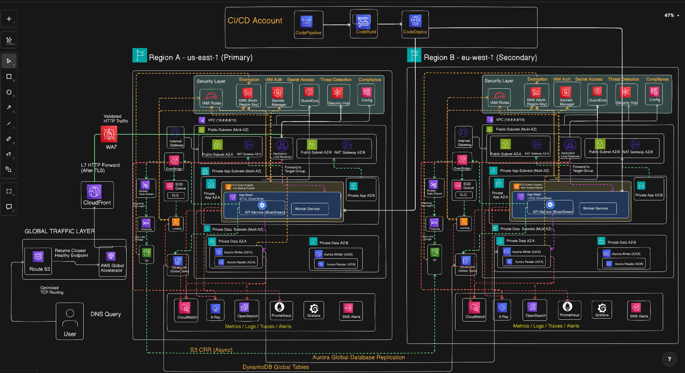

# 🌐 Enterprise Multi-Region SaaS Platform on AWS

[](https://www.terraform.io/)
[](https://aws.amazon.com/)
[](LICENSE)
[](https://github.com)

> A production-grade, multi-region SaaS infrastructure deployed across AWS US-East-1 and EU-West-1 using Terraform, featuring high availability, disaster recovery, and comprehensive observability.

---

## 📋 Table of Contents

- [Overview](#-overview)
- [Architecture](#-architecture)
- [Features](#-features)
- [Tech Stack](#-tech-stack)
- [Prerequisites](#-prerequisites)
- [Project Structure](#-project-structure)
- [Getting Started](#-getting-started)
- [Module Documentation](#-module-documentation)
- [Deployment Guide](#-deployment-guide)
- [Security](#-security)
- [Monitoring & Observability](#-monitoring--observability)
- [Disaster Recovery](#-disaster-recovery)
- [Cost Optimization](#-cost-optimization)
- [Troubleshooting](#-troubleshooting)
- [Contributing](#-contributing)
- [License](#-license)

---

## 🎯 Overview

This repository contains enterprise-grade Infrastructure as Code (IaC) for deploying a highly available, multi-region SaaS platform on AWS. The infrastructure is designed with production best practices including:

- **Multi-Region Architecture**: Primary region (US-East-1) with active-active failover to secondary region (EU-West-1)
- **Zero Trust Security**: Comprehensive security controls including KMS encryption, AWS Config, GuardDuty, and Security Hub
- **Global Data Replication**: Aurora Global Database, DynamoDB Global Tables, and S3 Cross-Region Replication
- **Edge Delivery**: CloudFront CDN with WAF protection and AWS Global Accelerator for optimal performance
- **Service Mesh**: AWS App Mesh for microservices communication and observability
- **CI/CD Pipeline**: Automated Blue/Green deployments using AWS CodePipeline and CodeDeploy
- **Comprehensive Monitoring**: CloudWatch, X-Ray, OpenSearch, Prometheus, and Grafana integration

---

## 🏗️ Architecture

### High-Level Architecture Diagram



### Regional Architecture

The infrastructure is deployed across two AWS regions for high availability and disaster recovery:

#### **Primary Region (US-East-1)**
- ✅ Multi-AZ VPC with public, private (app), and data subnets
- ✅ ECS Fargate clusters for containerized workloads
- ✅ Aurora PostgreSQL Global Database (writer instance)
- ✅ DynamoDB Global Tables
- ✅ Kinesis Data Streams and Firehose
- ✅ Application Load Balancer with Blue/Green deployment capability

#### **Secondary Region (EU-West-1)**
- ✅ Identical VPC architecture (different CIDR: 10.1.0.0/16)
- ✅ ECS Fargate clusters (read replicas)
- ✅ Aurora PostgreSQL Global Database (reader instance)
- ✅ DynamoDB Global Tables replica
- ✅ S3 Data Lake with cross-region replication

#### **Global Services**
- 🌍 CloudFront Distribution with origin failover
- 🌍 AWS Global Accelerator for TCP/UDP traffic
- 🌍 Route 53 with health checks
- 🌍 WAF v2 Web ACL
- 🌍 Multi-region KMS encryption

---

## ✨ Features

### 🔒 Security & Compliance
- **Encryption at Rest**: Multi-region KMS keys with automatic rotation
- **Encryption in Transit**: TLS 1.2+ enforced across all services
- **Network Isolation**: Private subnets for application and data tiers
- **VPC Endpoints**: Interface and Gateway endpoints to avoid internet egress
- **AWS Config**: Continuous compliance monitoring
- **GuardDuty**: Intelligent threat detection
- **Security Hub**: Centralized security findings aggregation
- **Secrets Management**: AWS Secrets Manager with cross-region replication

### 🚀 High Availability & Resilience
- **Multi-AZ Deployment**: All stateful services deployed across 2+ AZs
- **Auto-Scaling**: CPU/Memory-based scaling for ECS services
- **Global Database**: Aurora Global Database with <1s RPO and <1m RTO
- **CDN Failover**: Automatic CloudFront origin group failover
- **Health Checks**: ALB, Route 53, and application-level health monitoring
- **Blue/Green Deployments**: Zero-downtime deployments via CodeDeploy

### 📊 Observability & Monitoring
- **Centralized Logging**: CloudWatch Logs with retention policies
- **Distributed Tracing**: AWS X-Ray integration in all services
- **Metrics & Dashboards**: Amazon Managed Prometheus and Grafana
- **Log Analytics**: OpenSearch for log search and analysis
- **Application Insights**: ECS Container Insights enabled
- **Custom Alarms**: SNS-based alerting for critical metrics

### 🔄 Data Pipeline
- **Stream Processing**: Kinesis Data Streams for real-time ingestion
- **ETL**: Kinesis Firehose with Lambda transformations
- **Data Lake**: Versioned S3 buckets with lifecycle policies
- **Event-Driven**: EventBridge for decoupled event processing
- **Queue Management**: SQS with Dead Letter Queues

### 🛠️ DevOps & Automation
- **Infrastructure as Code**: 100% Terraform, modular design
- **CI/CD Pipeline**: Multi-region CodePipeline with parallel deployments
- **Container Registry**: ECR with image scanning enabled
- **Service Mesh**: AWS App Mesh for traffic management
- **GitOps Ready**: Structured for GitOps workflows

---

## 🛠️ Tech Stack

### Infrastructure
- **IaC**: Terraform 1.6+
- **Cloud Provider**: AWS (Multi-Region)
- **Networking**: VPC, Transit Gateway, PrivateLink
- **Container Orchestration**: ECS Fargate

### Compute & Services
- **Application Runtime**: Docker containers on ECS
- **Serverless**: Lambda functions for event processing
- **Service Mesh**: AWS App Mesh with Envoy proxy
- **Load Balancing**: Application Load Balancer (ALB)

### Data & Storage
- **Relational Database**: Aurora PostgreSQL (Global)
- **NoSQL Database**: DynamoDB (Global Tables)
- **Object Storage**: S3 with Cross-Region Replication
- **Streaming**: Kinesis Data Streams & Firehose
- **Caching**: ElastiCache (optional, can be added)

### Security & Identity
- **Encryption**: AWS KMS (Multi-Region Keys)
- **Secrets**: AWS Secrets Manager
- **Threat Detection**: GuardDuty, Security Hub
- **Compliance**: AWS Config, CloudTrail

### Observability
- **Logging**: CloudWatch Logs, OpenSearch
- **Metrics**: CloudWatch, Prometheus (AMP)
- **Tracing**: AWS X-Ray
- **Visualization**: Grafana (AMG)
- **Alerting**: SNS, CloudWatch Alarms

### Edge & CDN
- **CDN**: CloudFront with origin failover
- **Acceleration**: AWS Global Accelerator
- **DNS**: Route 53 with health-based routing
- **Security**: WAF v2 with managed rules

---

## 📋 Prerequisites

Before deploying this infrastructure, ensure you have:

### Required Tools
```bash
# Terraform
terraform >= 1.6.0

# AWS CLI
aws-cli >= 2.x

# Git
git >= 2.x
```

### AWS Account Requirements
- ✅ AWS Account with appropriate permissions
- ✅ Programmatic access (Access Key ID and Secret Access Key)
- ✅ Permissions to create resources in `us-east-1` and `eu-west-1`
- ✅ Service quotas verified (VPCs, EIPs, NAT Gateways, etc.)

### Infrastructure Prerequisites
1. **S3 Backend Bucket**: Create before running Terraform
   ```bash
   aws s3 mb s3://acme-terraform-state-prod-1 --region us-east-1
   aws s3api put-bucket-versioning \
     --bucket acme-terraform-state-prod-1 \
     --versioning-configuration Status=Enabled
   ```

2. **DynamoDB Lock Table**: For state locking
   ```bash
   aws dynamodb create-table \
     --table-name acme-terraform-locks-prod-1 \
     --attribute-definitions AttributeName=LockID,AttributeType=S \
     --key-schema AttributeName=LockID,KeyType=HASH \
     --billing-mode PAY_PER_REQUEST \
     --region us-east-1
   ```

3. **Container Images**: Build and push to ECR
   ```bash
   # Authenticate to ECR
   aws ecr get-login-password --region us-east-1 | \
     docker login --username AWS --password-stdin 123456789012.dkr.ecr.us-east-1.amazonaws.com
   
   # Build and push your application image
   docker build -t saas-api:latest .
   docker tag saas-api:latest 123456789012.dkr.ecr.us-east-1.amazonaws.com/saas-api:latest
   docker push 123456789012.dkr.ecr.us-east-1.amazonaws.com/saas-api:latest
   ```

---

## 📁 Project Structure

```
.
├── backend.tf                      # S3 backend configuration
├── providers.tf                    # AWS provider configuration (multi-region)
├── live/
│   └── prod/
│       ├── global.tf               # Global resources (Edge, Security Baseline)
│       ├── providers.tf            # Environment-specific providers
│       ├── us-east-1/
│       │   ├── main.tf             # US primary region resources
│       │   └── networking/
│       │       ├── main.tf         # VPC, subnets for US
│       │       └── outputs.tf
│       └── eu-west-1/
│           ├── main.tf             # EU secondary region resources
│           └── networking/
│               ├── main.tf         # VPC, subnets for EU
│               └── outputs.tf
│
└── modules/
    ├── networking/                 # VPC, Subnets, NAT, IGW, VPC Endpoints
    ├── compute/                    # ECS Fargate, ALB, Auto-scaling
    ├── database/                   # Aurora PostgreSQL (Regional)
    ├── database-global/            # Aurora Global Database
    ├── dynamodb-global/            # DynamoDB Global Tables
    ├── app-mesh/                   # AWS App Mesh configuration
    ├── security-baseline/          # KMS, GuardDuty, Security Hub, Config
    ├── edge/                       # CloudFront, WAF, Global Accelerator, Route53
    ├── observability/              # CloudWatch, X-Ray, OpenSearch, Prometheus, Grafana
    ├── data-pipeline/              # Kinesis, Firehose, Lambda, S3 Data Lake
    └── cicd/                       # CodePipeline, CodeBuild, CodeDeploy
```

### Module Descriptions

| Module | Purpose | Key Resources |
|--------|---------|--------------|
| **networking** | Network foundation | VPC, Subnets, NAT Gateway, Internet Gateway, VPC Endpoints |
| **compute** | Application runtime | ECS Cluster, Fargate Tasks, ALB, Target Groups, Auto-scaling |
| **database** | Regional database | Aurora PostgreSQL Cluster, Instances, Security Groups |
| **database-global** | Global database | Aurora Global Cluster, Multi-region replication |
| **dynamodb-global** | NoSQL global tables | DynamoDB with global replication |
| **app-mesh** | Service mesh | App Mesh, Virtual Nodes, Cloud Map |
| **security-baseline** | Security foundation | Multi-region KMS, GuardDuty, Security Hub, AWS Config |
| **edge** | Edge delivery | CloudFront, WAF, Global Accelerator, Route 53 |
| **observability** | Monitoring stack | CloudWatch, X-Ray, OpenSearch, Prometheus, Grafana |
| **data-pipeline** | Data processing | Kinesis Streams, Firehose, Lambda, S3, EventBridge, SQS |
| **cicd** | Deployment pipeline | CodePipeline, CodeBuild, CodeDeploy |

---

## 🚀 Getting Started

### Step 1: Clone the Repository
```bash
git clone https://github.com/rohandeb2/terraform-aws-multi-region-saas-platform.git
cd terraform-aws-multi-region-saas-platform
```

### Step 2: Configure AWS Credentials
```bash
# Configure AWS CLI
aws configure

# Or export environment variables
export AWS_ACCESS_KEY_ID="your-access-key"
export AWS_SECRET_ACCESS_KEY="your-secret-key"
export AWS_DEFAULT_REGION="us-east-1"
```

### Step 3: Update Configuration Variables

Create `terraform.tfvars` (this file is gitignored for security):
```hcl
# Update these values for your environment
name_prefix     = "acme-prod"
domain_name     = "yourdomain.com"
alert_email     = "alerts@yourdomain.com"
container_image = "123456789012.dkr.ecr.us-east-1.amazonaws.com/saas-api:latest"

# Database credentials (use Secrets Manager in production)
db_username = "admin_user"
# db_password will be auto-generated by Terraform
```

### Step 4: Initialize Terraform
```bash
terraform init
```

### Step 5: Plan the Deployment
```bash
terraform plan -out=tfplan
```

### Step 6: Apply the Infrastructure
```bash
terraform apply tfplan
```

### Step 7: Verify Deployment
```bash
# Check ECS services
aws ecs list-services --cluster acme-prod-use1-cluster --region us-east-1

# Check ALB health
aws elbv2 describe-target-health \
  --target-group-arn <target-group-arn> \
  --region us-east-1

# Test application endpoint
curl https://www.yourdomain.com/health
```

---

## 📚 Module Documentation

### Networking Module
**Location**: `modules/networking/`

Creates a production-grade VPC with the following:
- **3-tier subnet architecture**: Public, Private (App), Private (Data)
- **Multi-AZ**: Resources spread across 2 availability zones
- **NAT Gateway**: High availability with one NAT GW per AZ
- **VPC Endpoints**: S3, DynamoDB (Gateway), ECR, Secrets Manager, CloudWatch (Interface)

**Inputs**:
- `vpc_cidr`: CIDR block for VPC (e.g., "10.0.0.0/16")
- `name_prefix`: Naming prefix for resources
- `endpoint_sg_id`: Security group for VPC interface endpoints

**Outputs**:
- `vpc_id`, `public_subnet_ids`, `app_subnet_ids`, `data_subnet_ids`

---

### Compute Module
**Location**: `modules/compute/`

Deploys containerized applications on ECS Fargate:
- **ECS Cluster**: With Container Insights enabled
- **Fargate Tasks**: Including app container, X-Ray daemon, and Envoy sidecar
- **Application Load Balancer**: With Blue/Green target groups
- **Auto-scaling**: Based on CPU/Memory utilization
- **Service Mesh Integration**: App Mesh virtual node configuration

**Inputs**:
- `container_image`: ECR image URI
- `vpc_id`, `public_subnet_ids`, `app_subnet_ids`
- `app_mesh_node_arn`: ARN of the App Mesh virtual node
- `min_capacity`, `max_capacity`: Auto-scaling bounds

**Outputs**:
- `alb_dns_name`, `ecs_cluster_name`, `ecs_service_name`
- `blue_target_group_name`, `green_target_group_name`
- `service_sg_id`: Security group for ECS tasks

---

### Database Module (Regional)
**Location**: `modules/database/`

Deploys Aurora PostgreSQL cluster:
- **Aurora Cluster**: PostgreSQL 15.4 engine
- **Multi-AZ**: 2 instances (1 writer, 1 reader)
- **Encryption**: KMS encryption at rest
- **Backups**: 7-day retention with point-in-time recovery
- **Performance Insights**: Enabled for query analysis
- **Secrets Manager**: Auto-generated credentials

**Inputs**:
- `vpc_id`, `data_subnet_ids`
- `kms_key_arn`, `app_security_group_id`
- `global_cluster_identifier`: For joining global cluster (optional)

**Outputs**:
- `cluster_endpoint`, `reader_endpoint`, `secrets_manager_arn`

---

### Database Global Module
**Location**: `modules/database-global/`

Creates Aurora Global Database spanning multiple regions:
- **Global Cluster**: Shell resource for global replication
- **Primary Cluster**: Writer cluster in us-east-1
- **Secondary Cluster**: Read replica in eu-west-1
- **Cross-Region Replication**: <1 second replication lag
- **Disaster Recovery**: Promotion capability for RTO <1 minute

**Inputs**:
- Region-specific subnet groups, security groups, and KMS keys
- `master_username`, `master_password`

**Outputs**:
- `global_cluster_id`, `primary_endpoint`, `secondary_reader_endpoint`

---

### Security Baseline Module
**Location**: `modules/security-baseline/`

Foundational security controls:
- **Multi-Region KMS**: Primary key in us-east-1 with replica in eu-west-1
- **GuardDuty**: Enabled in both regions
- **Security Hub**: With findings aggregation to primary region
- **AWS Config**: Continuous compliance recording
- **IAM Roles**: Least-privilege auditor role

**Inputs**:
- `name_prefix`, `config_bucket_name`, `security_alerts_email`

**Outputs**:
- `kms_primary_key_arn`, `kms_replica_key_arn`
- `guardduty_primary_id`, `security_hub_aggregator_arn`

---

### Edge Module
**Location**: `modules/edge/`

Global edge delivery infrastructure:
- **CloudFront**: Distribution with origin failover group
- **WAF v2**: Web ACL with managed rule sets
- **Global Accelerator**: For TCP traffic acceleration
- **Route 53**: Health-checked DNS records
- **ACM Certificate**: SSL/TLS for custom domain

**Inputs**:
- `us_alb_dns_name`, `eu_alb_dns_name` (ALB endpoints)
- `us_alb_arn`, `eu_alb_arn` (for Global Accelerator)
- `domain_name`: Primary domain

**Outputs**:
- CloudFront distribution domain name
- Global Accelerator DNS name

---

### Observability Module
**Location**: `modules/observability/`

Comprehensive monitoring and observability:
- **CloudWatch Logs**: Centralized log aggregation
- **X-Ray**: Distributed tracing with sampling rules
- **OpenSearch**: Log search and analytics (2-node cluster)
- **Prometheus (AMP)**: Metrics collection workspace
- **Grafana (AMG)**: Visualization and dashboards
- **SNS Alerts**: Email notifications for critical events

**Inputs**:
- `name_prefix`, `kms_key_arn`, `alert_email`

**Outputs**:
- `prometheus_endpoint`, `grafana_endpoint`, `opensearch_endpoint`

---

### Data Pipeline Module
**Location**: `modules/data-pipeline/`

Event-driven data pipeline:
- **Kinesis Data Streams**: Real-time data ingestion
- **Kinesis Firehose**: Delivery to S3 with Lambda transformation
- **EventBridge**: Custom event bus
- **SQS**: Queue with Dead Letter Queue
- **S3 Data Lake**: Versioned, encrypted, with cross-region replication
- **Lambda**: Event processing functions

**Inputs**:
- `kms_key_arn`, `destination_bucket_arn`, `destination_kms_key_arn`
- `kinesis_shards`: Number of Kinesis shards

**Outputs**:
- `event_bus_arn`, `kinesis_stream_name`, `data_lake_bucket_id`

---

### CI/CD Module
**Location**: `modules/cicd/`

Automated deployment pipeline:
- **CodePipeline**: Multi-stage pipeline with parallel regional deployments
- **CodeBuild**: Docker image builds with ECR push
- **CodeDeploy**: Blue/Green ECS deployments
- **Cross-Account**: Support for separate CI/CD account
- **Artifact Replication**: Dual-region artifact buckets

**Inputs**:
- Repository info, ECS cluster/service names
- ALB listener ARN, target group names
- Cross-account role ARNs

**Outputs**:
- `pipeline_arn`, `codebuild_project_name`

---

## 📖 Deployment Guide

### Phase 1: Core Infrastructure
Deploy foundational networking and security:

```bash
# Deploy security baseline first (KMS, GuardDuty, etc.)
cd live/prod
terraform apply -target=module.security_baseline

# Deploy VPC and networking in both regions
terraform apply -target=module.vpc_us_east_1
terraform apply -target=module.vpc_eu_west_1
```

### Phase 2: Data Layer
Deploy databases and storage:

```bash
# Deploy regional Aurora clusters
terraform apply -target=module.aurora

# Deploy DynamoDB global tables
terraform apply -target=module.dynamodb_global

# Deploy data pipeline
terraform apply -target=module.data_pipeline
```

### Phase 3: Compute Layer
Deploy application runtime:

```bash
# Deploy ECS clusters and App Mesh
terraform apply -target=module.ecs_fargate
terraform apply -target=module.app_mesh
```

### Phase 4: Edge & Global Services
Deploy CDN and global routing:

```bash
# Deploy CloudFront, WAF, and Global Accelerator
terraform apply -target=module.edge_stack
```

### Phase 5: Observability
Deploy monitoring stack:

```bash
# Deploy observability infrastructure
terraform apply -target=module.observability
```

### Phase 6: CI/CD Pipeline
Deploy automation:

```bash
# Deploy CodePipeline and CodeDeploy
terraform apply -target=module.cicd
```

### Phase 7: Full Deployment
Apply complete infrastructure:

```bash
# Review the full plan
terraform plan

# Apply everything
terraform apply
```

---

## 🔒 Security

### Encryption
- **At Rest**: All data encrypted using AWS KMS with multi-region keys
- **In Transit**: TLS 1.2+ enforced on all connections
- **Secrets**: AWS Secrets Manager with automatic rotation

### Network Security
- **Private Subnets**: Application and data tiers isolated from internet
- **Security Groups**: Least-privilege access rules
- **NACLs**: Additional network layer protection (can be added)
- **VPC Endpoints**: Eliminates internet gateway for AWS services

### Identity & Access
- **IAM Roles**: Service-specific roles with minimal permissions
- **No Hardcoded Credentials**: All secrets in Secrets Manager
- **Auditing**: CloudTrail enabled in all regions

### Compliance & Monitoring
- **AWS Config**: Continuous compliance monitoring
- **GuardDuty**: ML-based threat detection
- **Security Hub**: Aggregated security findings
- **Automated Alerts**: SNS notifications for security events

### Best Practices Implemented
✅ Deletion protection on production databases  
✅ MFA delete on S3 buckets (can be enabled)  
✅ Versioning on critical S3 buckets  
✅ KMS key rotation enabled  
✅ VPC Flow Logs (can be added)  
✅ S3 bucket public access blocked  
✅ Encrypted EBS volumes  
✅ RDS automated backups  

---

## 📊 Monitoring & Observability

### CloudWatch Dashboards
Pre-configured dashboards for:
- ECS service health and performance
- ALB request metrics
- Aurora database performance
- Lambda function execution
- API Gateway metrics (if added)

### X-Ray Tracing
Distributed tracing enabled for:
- ECS tasks (with X-Ray daemon sidecar)
- Lambda functions
- API calls between services

### Prometheus Metrics
Available in Amazon Managed Prometheus:
- Container metrics
- Custom application metrics
- Infrastructure metrics

### Grafana Dashboards
Managed Grafana workspace with:
- CloudWatch data source
- Prometheus data source
- X-Ray data source
- Pre-built dashboards for AWS services

### Log Aggregation
- **CloudWatch Logs**: Real-time log streaming
- **OpenSearch**: Log search and analysis with Kibana
- **Retention**: 30-day retention on application logs

### Alerting
SNS topics configured for:
- High CPU/Memory utilization
- Database connection pool exhaustion
- ALB 5xx error rate spikes
- GuardDuty findings
- Security Hub critical findings

---

## 🛡️ Disaster Recovery

### RTO & RPO Targets
- **Recovery Time Objective (RTO)**: < 5 minutes
- **Recovery Point Objective (RPO)**: < 1 second

### Failover Strategy

#### Database Failover
Aurora Global Database automatic failover:
```bash
# Promote EU cluster to primary (in case of us-east-1 failure)
aws rds failover-global-cluster \
  --global-cluster-identifier acme-prod-global-db \
  --target-db-cluster-identifier acme-prod-euw1-aurora-cluster \
  --region eu-west-1
```

#### Application Failover
CloudFront automatically routes to healthy origin:
- Primary origin health check fails → traffic routed to EU
- Recovery is automatic, no manual intervention required

#### DNS Failover
Route 53 health checks monitor ALB endpoints:
- Unhealthy endpoint → Route 53 removes from DNS pool
- Automatic recovery when health is restored

### Backup Strategy
- **RDS**: Automated daily backups (7-day retention)
- **DynamoDB**: Point-in-time recovery enabled
- **S3**: Versioning enabled on all buckets
- **ECS**: Task definitions versioned
- **Terraform State**: S3 versioning + DynamoDB locking

### Testing DR Plan
```bash
# Simulate region failure
# 1. Stop ECS tasks in us-east-1
aws ecs update-service \
  --cluster acme-prod-use1-cluster \
  --service acme-prod-use1-api-service \
  --desired-count 0 \
  --region us-east-1

# 2. Verify CloudFront routes to EU
curl -I https://www.yourdomain.com

# 3. Restore service
aws ecs update-service \
  --cluster acme-prod-use1-cluster \
  --service acme-prod-use1-api-service \
  --desired-count 2 \
  --region us-east-1
```

---

## 💰 Cost Optimization

### Estimated Monthly Costs
| Service | Estimated Cost (USD) |
|---------|---------------------|
| ECS Fargate (2 regions) | $150 - $300 |
| Aurora Global Database | $400 - $600 |
| DynamoDB (on-demand) | $50 - $200 |
| ALB (2 regions) | $40 - $60 |
| NAT Gateway (4 total) | $180 - $200 |
| S3 + Replication | $50 - $150 |
| CloudFront + WAF | $100 - $300 |
| OpenSearch | $100 - $200 |
| Prometheus + Grafana | $50 - $100 |
| **Total (approx)** | **$1,120 - $2,110/mo** |

*Note: Costs vary based on traffic, data transfer, and usage patterns*

### Cost Optimization Strategies

1. **Right-Sizing**
   - Use Fargate Spot for non-critical workloads
   - Aurora Serverless v2 for variable workloads
   - Reserved Instances for predictable workloads

2. **Network Costs**
   - Use VPC endpoints to avoid NAT Gateway charges
   - Optimize cross-region data transfer
   - Enable S3 Transfer Acceleration only when needed

3. **Storage Optimization**
   - S3 Intelligent-Tiering for data lake
   - Lifecycle policies to move old data to Glacier
   - Clean up old EBS snapshots

4. **Monitoring Costs**
   - Adjust CloudWatch log retention
   - Use Prometheus for custom metrics (cheaper than CloudWatch custom metrics)
   - Sample X-Ray traces (5% sampling configured)

5. **Development/Staging Environments**
   - Use Terraform workspaces for lower environments
   - Reduce instance counts in dev/staging
   - Shut down non-prod environments after hours

---

## 🐛 Troubleshooting

### Common Issues

#### Issue: Terraform State Lock
**Problem**: `Error acquiring the state lock`

**Solution**:
```bash
# Identify the lock
aws dynamodb get-item \
  --table-name acme-terraform-locks-prod-1 \
  --key '{"LockID": {"S": "acme-terraform-state-prod-1/prod/multi-region-platform/terraform.tfstate-md5"}}'

# Force unlock (use with caution)
terraform force-unlock <LOCK_ID>
```

#### Issue: ECS Service Not Starting
**Problem**: Tasks fail to start or immediately crash

**Solution**:
```bash
# Check task logs
aws logs tail /ecs/acme-prod-use1-app --follow --region us-east-1

# Describe stopped tasks
aws ecs describe-tasks \
  --cluster acme-prod-use1-cluster \
  --tasks <task-id> \
  --region us-east-1
```

**Common causes**:
- Container image not found in ECR
- Insufficient IAM permissions
- Resource limits (CPU/memory)
- Health check failures

#### Issue: Aurora Global Database Lag
**Problem**: Replication lag > 1 second

**Solution**:
```bash
# Check replication lag
aws rds describe-db-clusters \
  --db-cluster-identifier acme-prod-euw1-aurora-cluster \
  --region eu-west-1 \
  --query 'DBClusters[0].GlobalWriteForwardingStatus'

# Check CloudWatch metrics
# Navigate to: CloudWatch > Metrics > RDS > AuroraGlobalDBReplicationLag
```

#### Issue: CloudFront Not Serving Latest Content
**Problem**: CDN serving stale content

**Solution**:
```bash
# Create invalidation
aws cloudfront create-invalidation \
  --distribution-id <distribution-id> \
  --paths "/*"
```

#### Issue: VPC Endpoint Connection Failures
**Problem**: Services can't connect to AWS APIs via VPC endpoints

**Solution**:
- Verify security group allows HTTPS (443) from VPC CIDR
- Check route tables include endpoint routes
- Ensure DNS is enabled on VPC

---

## 🤝 Contributing

We welcome contributions! Please follow these guidelines:

### How to Contribute

1. **Fork the repository**
2. **Create a feature branch**
   ```bash
   git checkout -b feature/amazing-feature
   ```
3. **Commit your changes**
   ```bash
   git commit -m 'Add amazing feature'
   ```
4. **Push to your branch**
   ```bash
   git push origin feature/amazing-feature
   ```
5. **Open a Pull Request**

### Coding Standards
- Follow Terraform best practices
- Use meaningful variable and resource names
- Add comments for complex logic
- Update documentation for new features
- Test changes in a dev environment first

### Pull Request Checklist
- [ ] Code follows project conventions
- [ ] Documentation updated (README, module docs)
- [ ] `terraform fmt` applied
- [ ] `terraform validate` passes
- [ ] Tested in isolated environment
- [ ] No sensitive data committed

---

## 📄 License

This project is licensed under the MIT License - see the [LICENSE](LICENSE) file for details.

---
Made with ❤️ by DevOps Engineers, for DevOps Engineers

</div>
